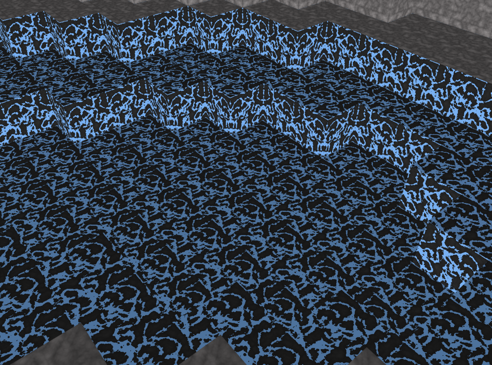

# Computer Graphics Minecraft Project

### Required Features
- [✅] Terrain Synthesis (60pts): Multi-octave value noise was implemeted to generate the heights of the 3x3 chunk terrain with seamless chunk boundaries. To make the map generation more efficiently, I optimized away generating all blocks to blocks that could be visible to the player.

- [✅] Procedural Textures (40pts): In the shader code, Perlin noise was implemented with multiple octaves to generate smooth random textures. 3 different types of textures are created: water, stone, and snow, and had these blocks rendered based on the height of the terrain. Water is rendered at low level, snow is rendered at high level, and stone is rendered in between. 

- [✅] FPS Controls (30pts): For collision detect, i checked blocks in a 3x3 area centered around the player to check whether a input move is valid. If there is an intersection, we ignore the input. And I split this into 2 parts: side collisions and vertical collisions. This ensures that if the player is jumping while running into a block, they will still be able to move. When we are at chunk boundaries we also check neighboring chunks for collisions, to ensure that we do not clip through blocks there.

### Extra Credit (20 points total)
- [✅] Time-varying perlin noise (+10): we implemented time varying 2D perlin noise for water texture with flowing effects.

- [✅] Hysteresis Thresholding (+5): To ensure that walking back and forth across chunk boundaries doesn't significantly affect performance, I maintain a cache of deleted chunks. Before generating new chunks, I check this cache. The size of this cache is configurable in App.ts, with a default size of 9, which matches the player's set of rendered chunks.

- [✅] Day Night Cycle (+5): I implemented a simple day and night cycle by adjusting the position of the light source over time, creating a circular movement centered around the player. Additionally, I added variation to the background color, creating a gradient based on the height of the light source to reflect the sky color corresponding to the in-game time. To control the speed of the day/night cycle, I used the LARROW and RARROW keys, which decrease and increase the cycle time by 10 seconds, respectively. The default cycle time is set to 60 seconds, with the minimum cycle time being 10 seconds.
